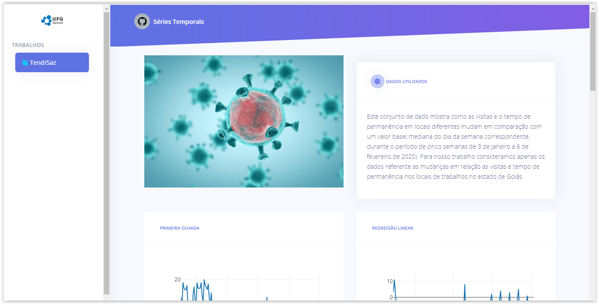

Trabalhos_Series_Temporais

Este repositório foi criado com o intuito de deixar registrado os trabalhos da disciplina de 
Núcleo Livre de Séries temporais do ano de 2020, ministrada pelo professor Renato de forma remota pela
Universidade Federal de Goiás. 

O Dashboard resultante dos trabalhos ainda não está publicado online.

